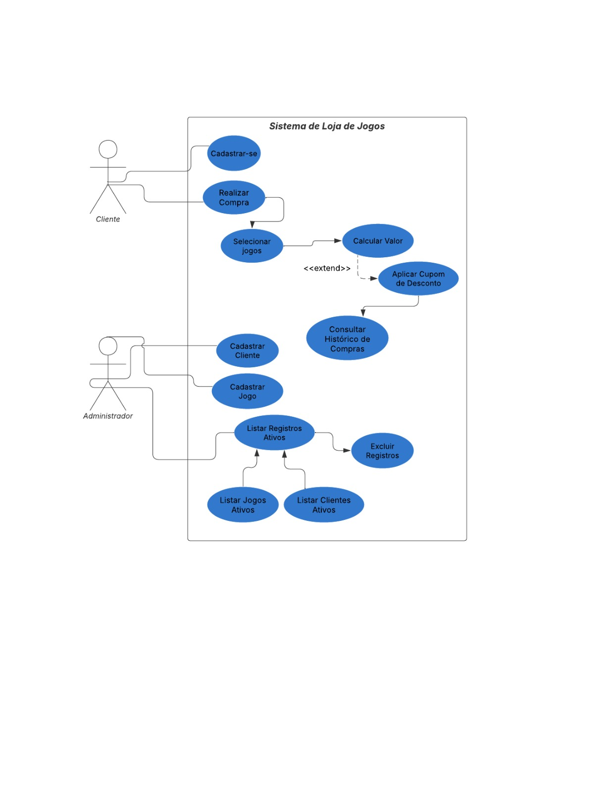
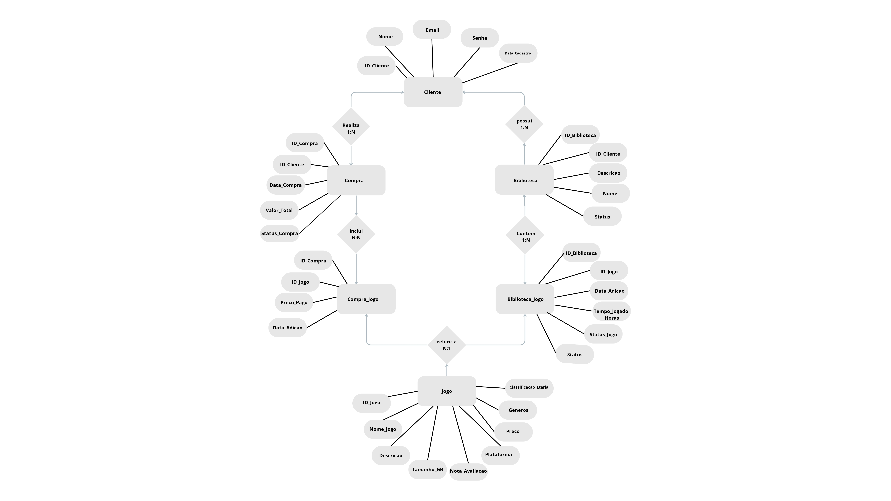
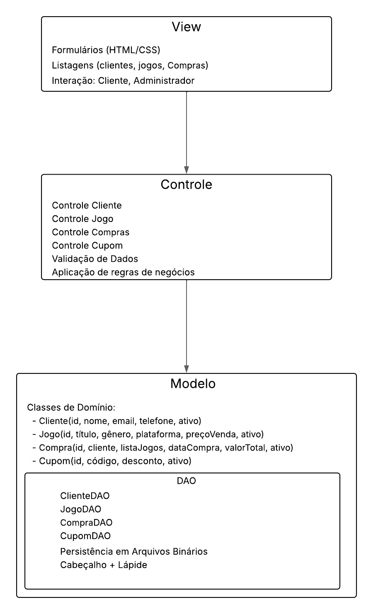

## Introdução
Este é um trabalho prático da disciplina de Algoritmos e Estruturas de Dados III (AEDS III) do curso de Ciência da Computação da Pontifícia Universidade Católica de Minas Gerais.
### Grupo: 
- Henrique Lourenço Pinto Coelho
- João Comini César de Andrade
- Rafael de Melo Alves Vilaça

## Tema Do Sistema
### Sistema de Gerenciamento de Venda e Biblioteca de Jogos
O sistema permite o cadastro e gerenciamento de clientes, jogos, compras e visualização de sua bibliotecas de jogos, com funcionalidades para registrar transações, controlar a biblioteca de cada cliente e gerar estatísticas de uso.

## Descrição do Problema

Atualmente, muitos jogadores e colecionadores utilizam planilhas ou anotações manuais para gerenciar suas bibliotecas de jogos e compras. Isso dificulta o controle da biblioteca, o acompanhamento de compras e o acesso a estatísticas sobre uso e gastos. Além disso, com a existência de diversas plataformas digitais de jogos, como Steam, Ubisoft Connect, Epic Games, entre outras, é comum que as pessoas se percam em meio à sua coleção, não sabendo exatamente onde determinado jogo está disponível ou se já possuem um título específico. Pensando nisso, decidimos criar um sistema de gerenciamento de biblioteca e venda de jogos para organizar e facilitar o acesso a essas informações.

Problemas enfrentados:
- Dificuldade para encontrar rapidamente informações sobre clientes, jogos e compras.
- Falta de padronização no registro de compras e adição de jogos à biblioteca.
- Risco de perda de dados e inconsistências.
- Ausência de um histórico centralizado para estatísticas e controle de acervo.
- Dificuldade em localizar em qual plataforma um jogo está disponível ou se já foi adquirido, devido à fragmentação das bibliotecas em múltiplas plataformas.

O sistema proposto visa resolver esses problemas oferecendo uma plataforma digital para:
  1. Cadastrar clientes, jogos, compras e bibliotecas.
  2. Registrar compras e adição de jogos à biblioteca de cada cliente.
  3. Consultar a biblioteca de jogos de cada cliente.
  4. Pesquisar clientes por nome e jogos por título.
  5. Garantir segurança das informações com criptografia de senhas.
  6. Otimizar buscas e consultas a biblioteca.
  7. Armazenar dados de forma compactada para economia de espaço.

## Objetivo do Trabalho
Desenvolver um sistema que:
- Permita CRUD de Clientes, Jogos, Compras e Bibliotecas.
- Implemente relacionamentos 1:N (Cliente → Biblioteca, Cliente → Compra) e N:N (Compra ↔ Jogos, Biblioteca ↔ Jogos).
- Utilize persistência em arquivos binários com cabeçalho e exclusão lógica (lápide).
- Ofereça busca eficiente por índices.
- Implemente criptografia para senhas de usuários.
- Disponibilize compactação/descompactação dos arquivos de dados.
- Permita pesquisa por nome de cliente e por título de jogo.

## Requisitos Funcionais (RF)
- **RF01:** Cadastrar cliente (nome, e-mail, senha, data de cadastro).
- **RF02:** Cadastrar jogo com: nome, descrição, tamanho (GB), classificação etária, gêneros(atributo multivalorado), plataforma, nota de avaliação, preço.
- **RF03:** Registrar compra com: cliente, data da compra, valor total, status, jogos adquiridos (N:N).
- **RF04:** Gerenciar biblioteca de jogos de cada cliente, incluindo data de adição, tempo jogado, status do jogo.
- **RF05:** Listar registros ativos e permitir exclusão lógica.
- **RF06:** Pesquisar cliente por nome e jogo por título.

## Requisitos Não Funcionais (RNF)
- **RNF01:** Interface gráfica (HTML/CSS)
- **RNF02:** Persistência em arquivos binários com cabeçalho (com informações de controle, como número de registros e último ID).
- **RNF03:** Uso de índices para buscas eficientes.
- **RNF04:** Criptografia para senhas.
- **RNF05:** Compactação para arquivos de dados.

## Atores
- **Cliente:** Gerencia sua biblioteca, realiza compras e consulta informações sobre jogos e histórico de compras.
- **Administrador:** Gerencia cadastros, compras e jogos.

## Diagrama de Caso de Uso

## Diagrama Entidade-Relacionamento

## Arquitetura Proposta

O sistema seguirá o padrão **MVC + DAO**, onde:
- **Model:** Classes de domínio (Cliente, Jogo, Compra, Biblioteca, Compra_Jogo, Biblioteca_Jogo).
- **DAO (Data Access Object):** Responsável pela persistência dos dados em arquivos binários e seus acessos, utilizando cabeçalhos e exclusão lógica (lápide).
- **Controller:** Regras de negócio e controle de fluxo da aplicação.
- **View:** Interface gráfica para interação com o usuário (HTML/CSS).

## Diagrama de Arquitetura em Camadas

## TP - PARTE 2

[Formula e instruções do tp parte 2](TP-PARTE2.md)